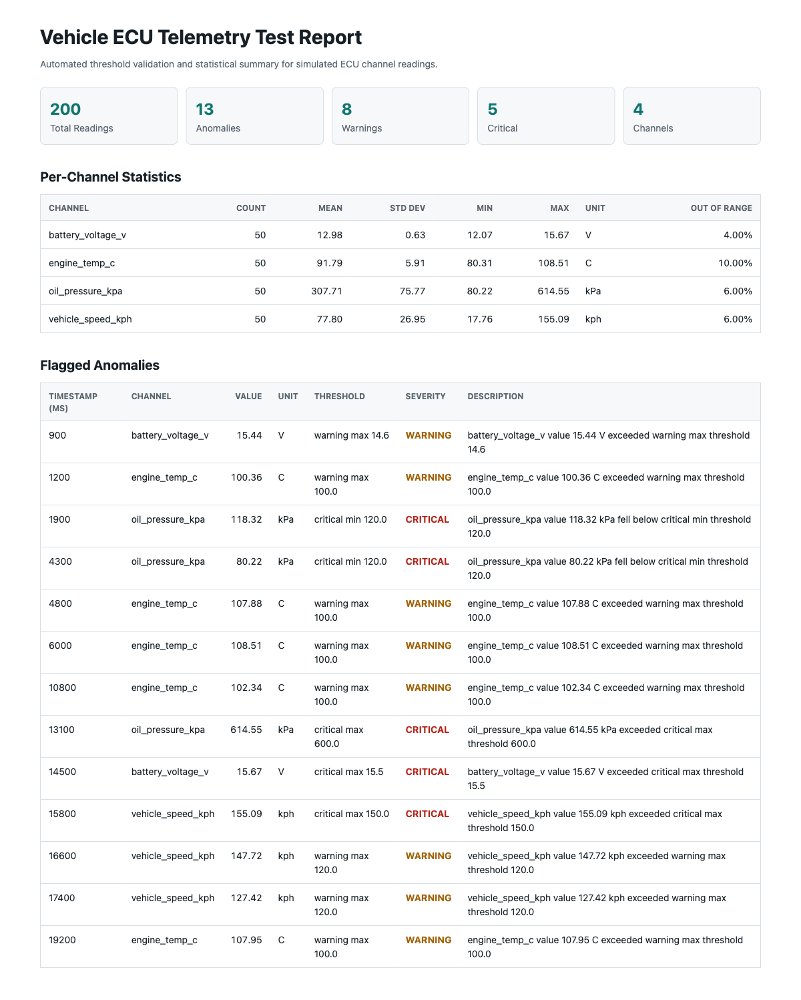
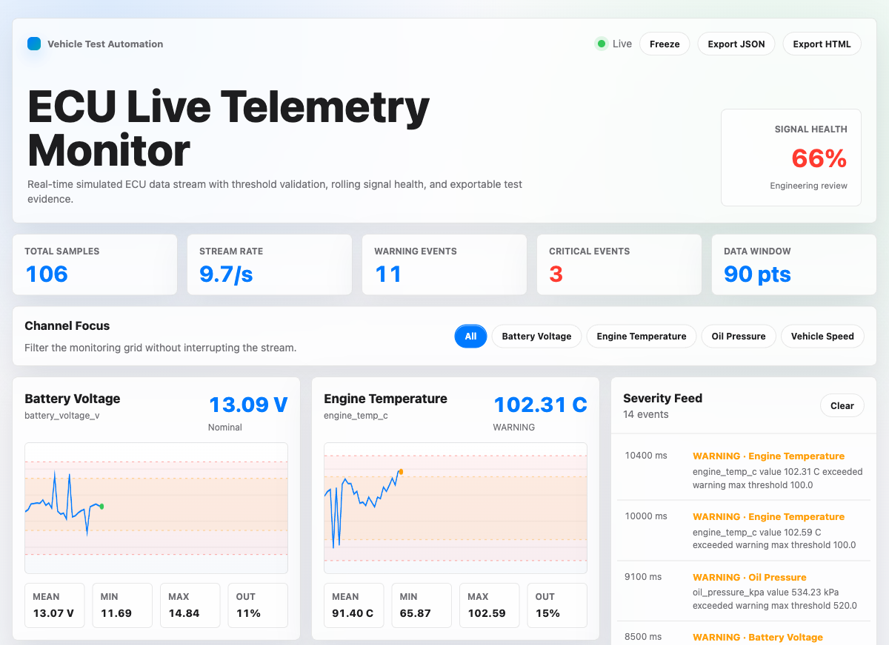
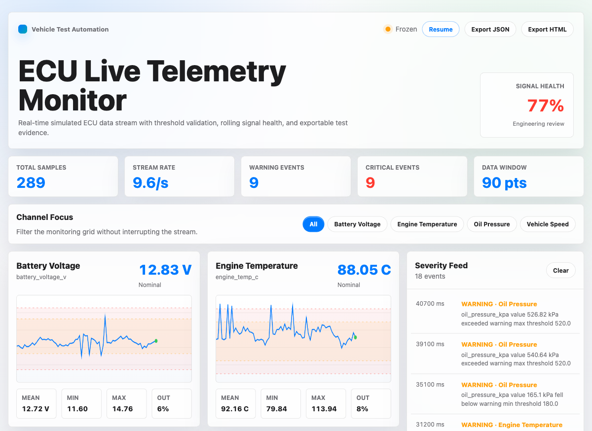
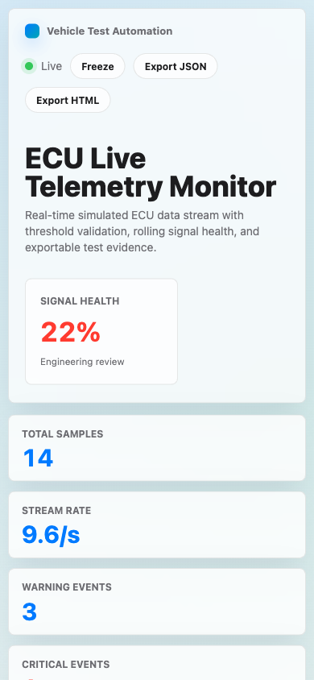

# Vehicle Test Automation

A Python CLI tool for automated analysis of simulated vehicle ECU telemetry. It ingests CSV readings, validates each sensor channel against configurable warning and critical thresholds, flags anomalies, computes engineering statistics, and produces structured JSON plus self-contained HTML reports.

This project is designed to demonstrate the kind of practical automation used by vehicle test, validation, and controls teams: Python scripting, test data analysis, configurable checks, unit testing, and clear reporting for engineering partners.

## Highlights

- Parses ECU telemetry CSV files with `timestamp_ms`, `channel`, `value`, and `unit`.
- Supports JSON threshold configs per channel with warning and critical min/max limits.
- Flags warning and critical anomalies with timestamp, breached threshold, severity, and readable descriptions.
- Computes per-channel statistics: count, mean, population standard deviation, min, max, and percent out of range.
- Writes both machine-readable `report.json` and self-contained `report.html`.
- Runs an Apple-inspired live SSE dashboard that simulates a real-time ECU stream with charts, severity feed, signal health, channel focus, freeze, and export.
- Includes a synthetic telemetry generator for realistic test runs.
- Uses only Python standard library at runtime. Tests use `pytest`.

## Project Structure

```text
vehicle-test-automation/
├── analyzer.py              # CSV parsing, threshold logic, anomaly detection, stats
├── reporter.py              # JSON and HTML report generation
├── main.py                  # argparse CLI entrypoint
├── dashboard_server.py      # Live SSE telemetry dashboard
├── generate_sample_data.py  # Synthetic ECU telemetry generator
├── config/
│   └── thresholds.json      # Example warning/critical channel thresholds
├── data/                    # Input telemetry CSVs
├── reports/                 # Generated JSON/HTML reports
└── tests/                   # pytest coverage for parsing, thresholds, anomalies, reports
```

## Quick Start

Create a virtual environment and install the test runner:

```bash
python3 -m venv .venv
.venv/bin/python -m pip install -r requirements-dev.txt
```

Generate sample telemetry:

```bash
.venv/bin/python generate_sample_data.py --output data/telemetry.csv --rows 500 --seed 42
```

Run the analyzer:

```bash
.venv/bin/python main.py --input data/telemetry.csv --config config/thresholds.json --output reports/
```

Open `reports/report.html` in a browser or consume `reports/report.json` from another tool.

## CLI Proof

The CLI produces both structured outputs from generated telemetry:

```bash
$ .venv/bin/python generate_sample_data.py --output data/telemetry.csv --rows 200 --seed 42
Wrote 200 synthetic telemetry rows to data/telemetry.csv

$ .venv/bin/python main.py --input data/telemetry.csv --config config/thresholds.json --output reports/
JSON report written to: reports/report.json
HTML report written to: reports/report.html
Analyzed 200 readings, flagged 13 anomalies.
```



## Live Dashboard

For interview demos, run the real-time dashboard:

```bash
.venv/bin/python dashboard_server.py --config config/thresholds.json --port 8765 --open
```

The dashboard uses Server-Sent Events from the Python stdlib HTTP server to simulate a live ECU stream. It renders live-updating charts per channel, signal-health scoring, stream-rate monitoring, rolling per-channel stats, threshold bands, a filterable severity feed, and freeze plus JSON/HTML export of the current live buffer.



Freeze the stream before talking through an anomaly sequence or exporting the current buffer:



The layout is responsive for smaller screens:



## Threshold Config Format

```json
{
  "channels": {
    "engine_temp_c": {
      "warning": { "min": 70.0, "max": 100.0 },
      "critical": { "min": 60.0, "max": 110.0 }
    }
  }
}
```

Critical thresholds are evaluated first. A value outside the critical band is flagged as `critical`; a value outside the warning band but still inside the critical band is flagged as `warning`.

## Example Output

The JSON report has three top-level sections:

- `summary`: total readings, anomaly counts, and channel count.
- `channels`: per-channel aggregate statistics.
- `anomalies`: timestamped warning/critical findings with threshold details.

The HTML report contains the same information in a readable, self-contained format that can be shared without any external assets or dependencies.

## Testing

Run the full test suite:

```bash
.venv/bin/python -m pytest -q
```

Coverage includes:

- CSV parsing and validation
- Threshold config normalization
- Warning vs. critical severity precedence
- Anomaly detection
- Per-channel statistics
- JSON and HTML report generation
- Live dashboard SSE payload generation and export analysis

## Why This Project Matters

Vehicle validation teams need fast, repeatable ways to turn raw test data into engineering decisions. This project models that workflow: ingest telemetry, apply configurable pass/fail criteria, summarize signal health, and produce reports that both automation systems and humans can use.
